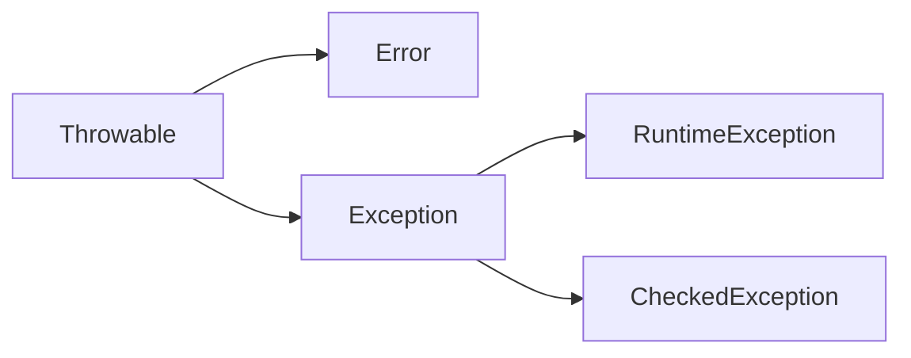
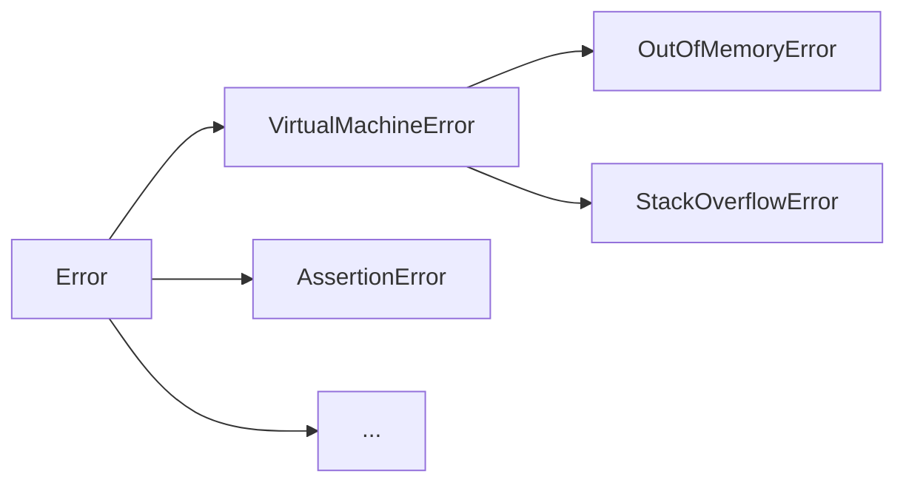
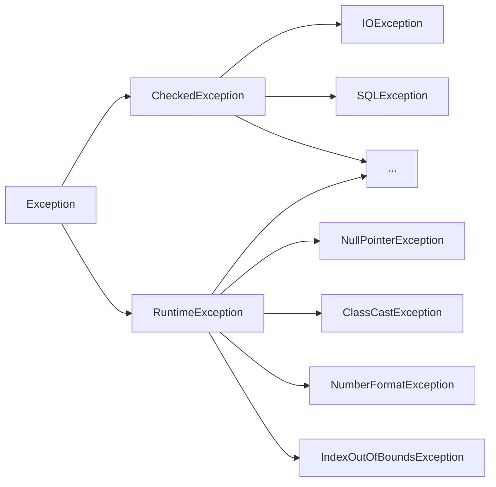

Java统一使用异常机制来处理错误。

### 1 异常基础
1. throw与return
- return代表正常退出，返回位置是确定的，即上级调用者
- throw代表异常退出，返回位置不确定，由异常处理机制动态决定

2. 异常处理机制
throw抛出异常会触发Java的异常处理机制，throw也可由Java虚拟机自己实现。
异常处理机制会从当前函数查找谁能捕获异常，当前函数没有则查看上一层，直到主函数。如果主函数也未捕获异常，则启用默认处理机制，打印异常栈信息并退出。

3. 捕获异常
异常栈信息是程序员看的，但普通用户需要更友好的提示，这需要依靠捕获异常实现，捕获异常使用`try...catch...`语句实现。
```java
try{
	//...
}catch(Exception e){
	//...
}
```

### 2 异常类
所有异常类都有共同的父类Throwable。

##### 2.1 Throwable
1. 构造方法
```java
public Throwable()
public Throwable(String message)
public Throwable(String message,Throwable cause)
public Throwable(Throwable cause)
```
- message：表示异常消息，cause：表示触发该异常的其他异常。异常可以形成一个异常链，上层异常由底层异常触发，cause表示底层异常。

2. 方法
```java
Throwable initCause(Throwable cause) //用于设置cause
void fillInStackTrace() //保存异常栈信息
void printStackTrace() //打印异常栈信息
void printStackTrace(PrintStream s)
void printStackTrace(PrintWriter s) //打印异常栈信息到指定的流
String getMessage() //获取设置的异常消息
Throwable getCause() //获取异常的cause
StackTraceElement[] getStackTrace() 
//获取异常栈每一层信息，每个element包括文件名、类名、函数名、行号等
```

##### 2.2 异常类体系
Java异常类以Throwable为根，分为Error和Exception两个子类，其中Exception又分为受检异常和未受检异常。
1. Throwable


2. Error
Error表示系统错误或资源耗尽，由Java系统使用，应用程序无法处理这种错误。
- 较为常见的Error

3. Exception
表示应用程序错误，分为受检异常和未受检异常（RuntimeException）。受检和未受检的区别在于Java强制要求程序员处理受检异常，未受检异常则无此要求。
- 常用异常

- 常用RuntimeException说明

|RuntimeException|说明|
|:---|:---|
|NullPointerException|空指针异常|
|ClassCastException|非法强制类型转换|
|NumberFormatException|数字格式错误|
|IndexOutOfBoundsException|索引越界|
|ArrayIndexOutOfBoundsException|数组索引越界|
|StringIndexOutOfBoundsException|字符串索引越界|
|IllegalStateException|非法状态|
|IllegalArgumentException|参数错误|

##### 2.3 自定义异常
可以通过继承Exception或其子类来自定义异常，如果继承自RuntimeException或其子类则是未受检异常，其他则为受检异常。

##### 2.4 异常处理
Java对异常的处理支持：catch、throw、finally、try-with-resources、throws。

1. catch
- try/catch可以捕获匹配的异常，其中catch可以有多条，每一条对应一种异常类型。如：
```java
try{
	//
}catch(NumberFormatException e){
	//...
}catch(RuntimeException e){
	//...
}catch(Exception e){
	//...
}
```
异常处理机制找到第一个匹配的catch后，就不再执行其他catch。
> 抛出异常类型也能匹配父类，因此需要将最具体的子类放在前面，否则匹配了基类Exception后，其他匹配不会执行。

- 更简洁的写法：使用`|`操作符
```java
try{
	//...
}catch(ExceptionA | ExceptionB e){
	//...
}
```

2. throw
throw意为重新抛出异常，当前代码不能完全处理该异常时就可重新抛出。抛出的异常可以是新建的，也可以是已经有的。
```java
try{
	//...
}catch(NumberFormatException e){
	//...
	throw new ExceptionA("...");
}catch(Exception e){
	//...
	throw e;
}
```

3. finally
- finally通常跟在catch后面，表示不管有无异常，都执行finally中的语句，一般用来释放资源。
```java
try{
	//...
}catch{
	//...
}finally{
	//...
}
```

- finally中的return
若try...catch...语句中有return语句，则return语句在finally结束后才执行，但是finally不能改变return的返回值。
```java
int res=0;
try{
	return res;
}finally{
	ret=2;
}
//最终返回res=0
```
若finally中也有return语句，try...catch...中的return就会丢失，实际返回finally中的return值。finally语句不仅会覆盖try...catch...的返回值，还会掩盖其中的异常。
```java
int res=0;
try{
	int a=5/0;
	return ret;
}finally{
	return 2;
}
//最终返回2，并且没有异常发生
```

> 一般而言，finally中应避免使用return或者抛出异常。

4. try-with-resources
try-with-resources语句专门用于使用资源的场景，针对实现了AutoCloseable接口的对象，可以自动调用释放资源的方法。
```java
try(AutoCloseable r=new FileInputStream("hello")){
	//...
}
```

5. throws
throws用于声明一个方法可以抛出异常
```java
public void methos() throws ExceptionA,ExceptionB{

}
```