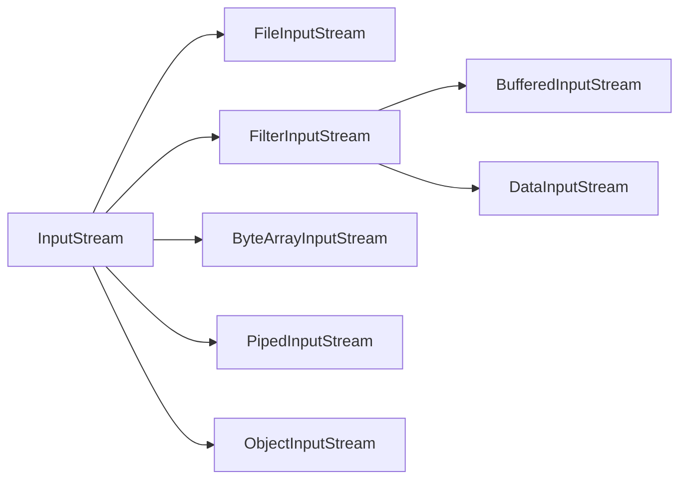
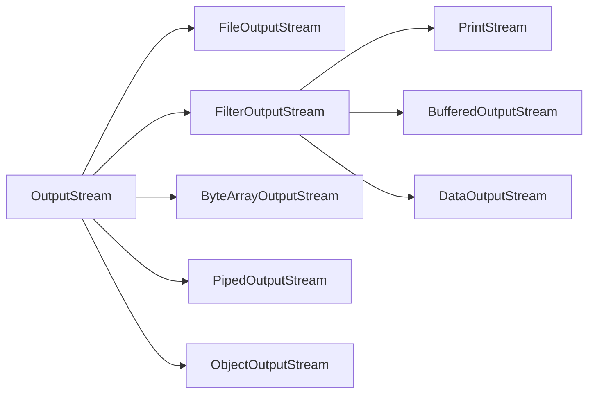

IO即In、Out，表示输入和输出，Java通过流来处理。

### 1. IO流
流按输入方式分为：输入流、输出流
按处理单位分为：字节流、字符流

##### 1.1 输入流和输出流
输入输出相对于应用程序而言，读文件是输入流，写文件是输出流，Java输入输出流的基类分别是InputStream、OutputStream，它们都是抽象类，主要用于处理二进制文件。为了更方便处理文本文件，也有能够按字符处理文件的基类Reader、Writer，它们同样是抽象类。

##### 1.2 字节流和字符流
1. 字节流
字节流按1Byte即8bit单位处理数据，字节流可以处理所有文件，包括文本文件和二进制文件。

> 所有文件都是以0和1的二进制形式保存的，包括可执行文件、图片、视频、word、压缩文件、txt、pdf，经过应用程序对其二进制形式进行解析，我们就看到它所展现的样子。

2. 字符流
字符流按2Byte即16bit单位处理数据，字符流只能处理纯文本文件。字符流的出现，是为了更方便地处理文本文件。

### 2. File
文件在Java中通过File类表示，这个类提供了文件路径、文件元数据、文件目录等有关方法。

##### 2.1 File构造器
```java
public class File extends Object implements Serializable,Comparable<File>{
	File(File parent,String child)
	File(String pathname)
	File(String parent,String child)
	File(URI uri)
}
```

##### 2.2 常用方法
|方法|说明|
|:--|:----|
|+createNewFile():boolean|创建此抽象路径名的新文件|
|+delete():boolean|删除此抽象路径名表示的文件或目录|
|+exists():boolean|此抽象路径名的文件或目录是否存在|
|+getAbsoluteFile():File|返回此抽象路径名的绝对路径形式文件|
|+getAbsolutePath():String|返回此抽象路径名的绝对路径名|
|+getName():String|获取此抽象路径名文件的文件名|
|+mkdir():boolean|创建此抽象路径名的目录|

### 3. InputStream/OutputStream
##### 3.1 InputStream
1. InputStream声明
InputStream是抽象类，是Java中输入流的基类。
```java
public abstract class InputStream extends Object implements Closeable{

}
```

2. 抽象方法
InputStream中的抽象方法
```java
public abstract int read() throws IOException;
```
该方法用于从InputStream中读取下一个字节，返回返回为0-255，读到结尾返回-1。如果流中没有数据，read方法会阻塞直到数据到来、流关闭或出现异常。出现异常read抛出IOException，这是受检异常，必须处理。read是抽象方法，InputStream的具体子类必须重写实现。

3. 具体方法
- read：该方法可用批量读取字节，读入的第一个字节存放到b\[off]中，最多读取len个字节。
```java
public int read(byte b[],int off,int len) throws IOException;
```
- read：该方法用于批量读取字节，一次最多读取字节个数为数组b的长度，内部实际是靠调用read(byte b\[],int off,int len)方法实现的。
```java
public int read(byte b[]) throws IOException{
	return read(b,0,b.length);
}
```
- close：流读取结束后，需要调用此方法关闭释放相关资源，close一般放在finally语句中，这样不管是否异常都会被执行。也可以在try-with-resource语句中被自动调用。
```java
public void close() throws IOException;
```

##### 3.2 OutputStream
1. OutputStream声明
```java
public abstract class OutputStream extends Object implements Closeable,Flushable{

}
```

2. 抽象方法
OutputStream的基本抽象方法
```java
public abstract void write(int b) throws IOException;
```
该方法用于向流写入一个字节，参数int一般用最低的8bit。该抽象方法，继承OutputStream的具体子类也必须实现。

3. 具体方法
- 两个用于批量写入的方法
```java
public void write(byte b[]) throws IOException
public void write(byte b[],int off,int len) throws IOException
```
- 将缓冲的数据写入
```java
public void flush() throws IOException
```
- 关闭
```java
public void close() throws IOException
```

##### 3.3 IO流体系
前文提到InputStream和OutputStream是抽象基类，它们由很多具体子类。
1. InputStream
- 关系图


2. OutputStream
- 关系图


3. FileInputStream/FileOutputStream
文件输入输出流

4. FilterInputStream/FilterOutputStream
装饰者类，具体的装饰者继承该类。
- DataInputStream/DataOutputStream
以Java基本数据类型如int、double、boolean、char等和字符串为单位读写数据的装饰类。
常用方法：
|read方法|write方法|说明|
|:--|:--|:---|
|readUTF()|writeUTF(String s)|读写字符串|
|readInt()|writeInt(int i)|读写int|
|readDouble()|writeDouble(double d)|读写double|
|readBoolean()|writeBoolean(boolean b)|读写boolean|
<!--这些方法用final声明，不能被重写-->

- BufferedInputStream/BufferedOutputStream
FileInputStream和FileOutputStream都是按字节单位在流中读取的，性能比较低，使用字节数组读取可以提高性能。
BufferedInputStream/BufferedOutputStream两个类内部有一个字节数组作为缓冲区，读写时先从缓冲区读写，缓冲区读写完毕再调用流。

6. ByteArrayInputStream/ByteArrayOutputStream
用于将文件输入输出到字节数组中，这个字节数组根据数据内容动态扩展。


### 4. Reader/Writer
