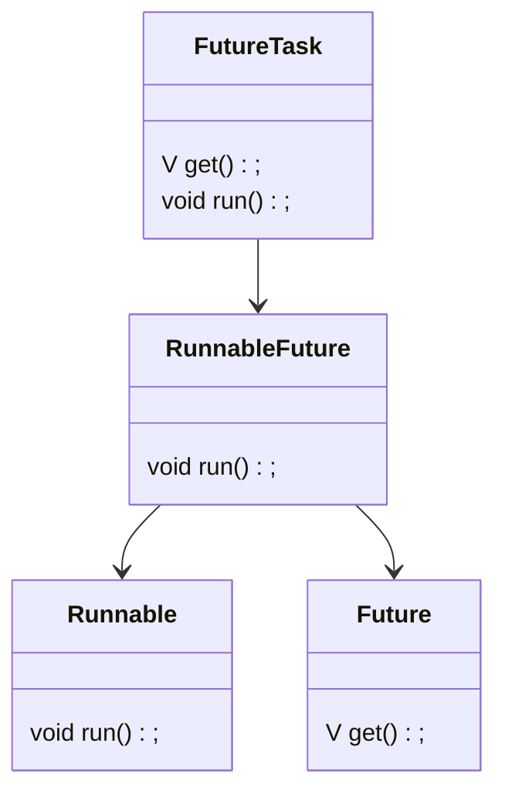

### 1. Java中的进程
##### 1.1 Java程序的进程
1. 进程的组成部分
进程的三个组成部分：程序段、数据段、进程控制块PCB（描述进程id，优先级、状态，进程上下文等信息）。

2. 什么是Java程序的进程
Java程序运行在JVM中，每当Java命令启动一个程序，就会启动一个JVM进程。在JVM进程内部，所有程序代码都以线程运行。JVM找到程序入口main方法，运行main方法产生一个主线程。当主线程完成，JVM也随即退出。

### 2. Java中的线程
##### 2.1 线程的基本原理
1. 线程的组成部分
标准线程由三部分组成：线程描述信息、程序计数器、栈内存。
- 线程描述信息：描述线程id，名称，状态，优先级信息
- 程序计数器：记录线程下一条指令的代码段的内存地址
- 栈内存：线程私有，存储代码段中的局部变量，不受GC管理。

2. 方法
Java中方法是程序执行流程的重要单位，也是栈内存的分配单位方法帧（栈帧）。方法的每一次执行都需要一个栈帧，保存方法的局部变量、返回地址等信息。线程执行流进入方法，JVM为方法分配栈帧并压入栈内存；线程流离开方法，JVM从栈内存弹出栈帧，回收内存空间。

4. Java中的线程
进程是程序执行和系统进行并发调度的最小单位。线程指“进程代码段”的一次顺序执行流程，是CPU调度的最小单位。一个进程可以有多个线程，各线程之间共享进程的内存空间、系统资源。
在Java中，Java命令执行class文件时就启动了一个JVM进程，理论上该进程内部至少有main线程和GC线程两个线程。实际上，执行一个Java程序的线程数量远不只有两个。

##### 2.2 Java中创建普通线程
1. Thread
Thread类表示Java中的线程，定义了很多操作线程的静态方法和实例方法。
- Thread的属性和相关方法
|属性|说明|相关方法|说明|
|:--|:--|:--|:--|
|id|线程id|getId|获取id|
|name|线程名称|set/getName|设置/获取name|
|priority|线程优先级(1~10，默认5)|set/getPriority|设置/获取priority|
|status|线程状态，Thread.State枚举类型|getStatus|获取status|
|isDaemon|是否是守护线程|isDaemon,setDaemon|是否是守护线程，设置为守护线程|
<!--守护线程是进程运行时提供某种后台服务的线程，比如GC线程-->
```java
//线程状态枚举类Thread.State
public static enum State{
	NEW,RUNNABLE,BLOCKED,WAITING,TIMED_WAITING,TERMINATED
}
```

- Thread的启动和运行
start()：启动线程，调用后JVM开启新线程执行用户定义的线程代码并分配资源，线程进入NEW状态
run()：线程代码逻辑的入口方法，start后线程获得CPU执行时间，便进入run方法执行具体代码

- 获得当前线程
静态方法Thread.currentThread()：返回当前CPU执行的线程。
<!--虽然一个进程有多个线程，但一个CPU内核上同一时刻只有一个线程正在执行，即currentThread。由于线程切换速度极快，所以看起来像同时进行。-->

2. 创建线程
1) 继承Thread类
继承Thread类，并重写run方法。
```Java
public class TestThread extends Thread{
	//...
	@Override
	public void run(){
		//...
	}
}
```

2) 实现Runnable接口
- Runnable接口
```java
@FunctionalInterface
public interface Runnable{
	void run();
}
```
 - 实现Runnable接口，重写run方法
```java
public class TestThread implements Runnable{
	//...
	public void run(){
		//...
	}
}
```

> 其实Thread类内部有一个Runnable实例target，作为线程执行目标，target不为空，Thread类的run方法调用了该执行目标的run方法.

3) 匿名类创建Runnable线程
若需要的target是一次性类，可以使用匿名形式
```java
Thread thread=new Thread(new Runnable(){
	public void run(){
		//...
	}
});
```

4) Lambda表达式
Runnable接口声明@FunctionalInterface注解，标记为“函数式接口”（函数式接口有且仅有一个抽象方法），实现接口时可用Lambda表达式实现（注意语言级别8及以上才支持Lambda）。
```java
Thread thread=new Thread(()->{
	//...
})
```

**Thread与Runnable对比：**
- 继承Thread能更好做到多个线程并发地完成各自的任务，访问各自的数据资源
- 实现Runnable能更好地做到多个线程并发地完成同一个任务，访问同一份数据资源
- 通过Runnable并发访问同一份数据资源时，需要进行线程的同步控制，避免数据操作时出现线程不安全问题。

##### 2.3 创建有返回值的线程
Thread和Runnable都不能获得线程异步执行结果，需要结果时可以通过Callable接口与FutureTask类相结合创建线程。

1. Callable接口
位于juc包中的接口，可以有返回值，可以抛出受检异常。
```java
@FunctionalInterface
public interface Callable<V>{
	V call() throws Exception;
}
```

2. Future接口
Future接口提供了如下功能：取消异步执行中的任务，判断异步执行任务是否完成，获取异步执行结果。
```java
public interface Future<V>{
	boolean cancel(boolean mayInterruptRunning);
	boolean isCancelled();
	boolean isDone();
	V get() throws InterruptedException,ExecutionException;
	V get(long timeout,TimeUnit u) throws InterruptedException,ExecutionException;
}
```

3. RunnableFuture接口
Callable接口实例不能直接作为Thread的实例参数（只能是Runnable实例），需要间接使用RunnableFuture接口。
RunnableFuture继承了Runnable和Future接口，可以作为Thread类的target实例，也可以获得异步执行结果。
```java
public interface RunnableFuture<V> extends Runnable,Future<V>{
	void run();
}
```

4. FutureTask类
FutureTask实现了RunnableFuture接口，既可以作为Thread类的target实例，又可以通过get方法获得异步执行结果。

**5. 使用FutureTask和Callable创建线程**
- 创建Callable接口实例，实现call方法，设置返回值
- 使用Callable实例构造FutureTask实例
- 使用FutureTask实例构造Thread实例
- 调用Thread实例的start方法（内部方法执行流程：start-->run-->call）


##### 2.4 通过线程池创建线程