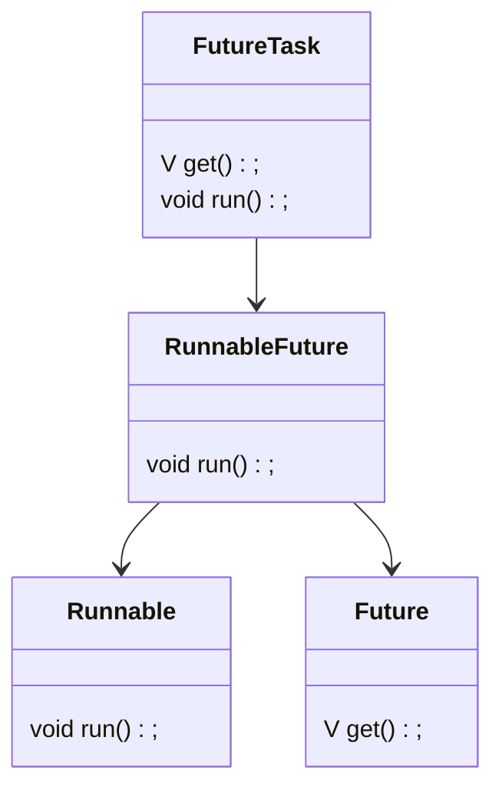
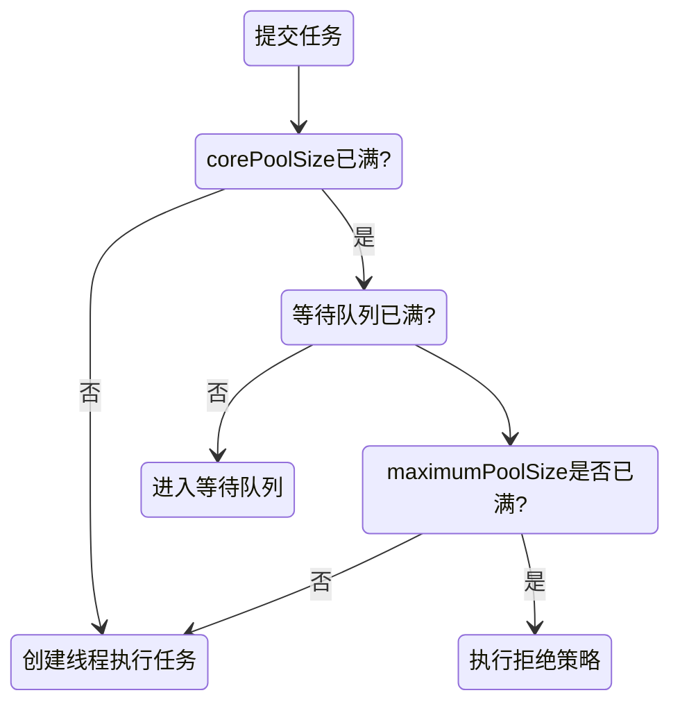

### 1. Java中的进程
##### 1.1 Java程序的进程
1. 进程的组成部分
进程的三个组成部分：程序段、数据段、进程控制块PCB（描述进程id，优先级、状态，进程上下文等信息）。

2. 什么是Java程序的进程
Java程序运行在JVM中，每当Java命令启动一个程序，就会启动一个JVM进程。在JVM进程内部，所有程序代码都以线程运行。JVM找到程序入口main方法，运行main方法产生一个主线程。当主线程完成，JVM也随即退出。

### 2. Java中的线程
##### 2.1 线程的基本原理
1. 线程的组成部分
标准线程由三部分组成：线程描述信息、程序计数器、栈内存。
- 线程描述信息：描述线程id，名称，状态，优先级信息
- 程序计数器：记录线程下一条指令的代码段的内存地址
- 栈内存：线程私有，存储代码段中的局部变量，不受GC管理。

2. 方法
Java中方法是程序执行流程的重要单位，也是栈内存的分配单位方法帧（栈帧）。方法的每一次执行都需要一个栈帧，保存方法的局部变量、返回地址等信息。线程执行流进入方法，JVM为方法分配栈帧并压入栈内存；线程流离开方法，JVM从栈内存弹出栈帧，回收内存空间。

3. Java中的线程
进程是程序执行和系统进行并发调度的最小单位。线程指“进程代码段”的一次顺序执行流程，是CPU调度的最小单位。一个进程可以有多个线程，各线程之间共享进程的内存空间、系统资源。
在Java中，Java命令执行class文件时就启动了一个JVM进程，理论上该进程内部至少有main线程和GC线程两个线程。实际上，执行一个Java程序的线程数量远不只有两个。

4. 线程调度
Java线程调度和大部分操作系统一样，都是抢占式调度模型，线程有优先级，Java的线程管理是委托给操作系统的。

5. 线程的生命周期
Java线程的生命周期通过Thread内部枚举类Thread.State描述，有6个状态：NEW, RUNNABLE,
BLOCKED, WAITING, TIMED_WAITING, TERMINATED;
线程新建后对应NEW状态，start后进入RUNNABLE状态，得到CPU时间片才会真正开始运行run。
与操作系统对应：


##### 2.2 Java中创建普通线程
1. Thread
Thread类表示Java中的线程，定义了很多操作线程的静态方法和实例方法。
- Thread的属性和相关方法
|属性|说明|相关方法|说明|
|:--|:--|:--|:--|
|id|线程id|getId|获取id|
|name|线程名称|set/getName|设置/获取name|
|priority|线程优先级(1~10，默认5)|set/getPriority|设置/获取priority|
|status|线程状态，Thread.State枚举类型|getStatus|获取status|
|isDaemon|是否是守护线程|isDaemon,setDaemon|是否是守护线程，设置为守护线程|
<!--守护线程是进程运行时提供某种后台服务的线程，比如GC线程-->
```java
//线程状态枚举类Thread.State
public static enum State{
	NEW,RUNNABLE,BLOCKED,WAITING,TIMED_WAITING,TERMINATED
}
```

- Thread的启动和运行
start()：启动线程，调用后JVM开启新线程执行用户定义的线程代码并分配资源，线程进入RUNNABLE状态（此时不一定立刻运行，要得到CPU时间片后，才会真正运行run）
run()：线程代码逻辑的入口方法，start后线程获得CPU执行时间，便进入run方法执行具体代码

- 获得当前线程
静态方法Thread.currentThread()：返回当前CPU执行的线程。
<!--虽然一个进程有多个线程，但一个CPU内核上同一时刻只有一个线程正在执行，即currentThread。由于线程切换速度极快，所以看起来像同时进行。-->

2. 创建线程
1) 继承Thread类
继承Thread类，并重写run方法。
```Java
public class TestThread extends Thread{
	//...
	@Override
	public void run(){
		//...
	}
}
```

2) 实现Runnable接口
- Runnable接口
```java
@FunctionalInterface
public interface Runnable{
	void run();
}
```
 - 实现Runnable接口，重写run方法
```java
public class TestThread implements Runnable{
	//...
	public void run(){
		//...
	}
}
```

> 其实Thread类内部有一个Runnable实例target，作为线程执行目标，target不为空，Thread类的run方法调用了该执行目标的run方法.

3) 匿名类创建Runnable线程
若需要的target是一次性类，可以使用匿名形式
```java
Thread thread=new Thread(new Runnable(){
	public void run(){
		//...
	}
});
```

4) Lambda表达式
Runnable接口声明@FunctionalInterface注解，标记为“函数式接口”（函数式接口有且仅有一个抽象方法），实现接口时可用Lambda表达式实现（注意语言级别8及以上才支持Lambda）。
```java
Thread thread=new Thread(()->{
	//...
})
```

**Thread与Runnable对比：**
- 继承Thread能更好做到多个线程并发地完成各自的任务，访问各自的数据资源
- 实现Runnable能更好地做到多个线程并发地完成同一个任务，访问同一份数据资源
- 通过Runnable并发访问同一份数据资源时，需要进行线程的同步控制，避免数据操作时出现线程不安全问题。

##### 2.3 创建有返回值的线程
Thread和Runnable都不能获得线程异步执行结果，需要结果时可以通过Callable接口与FutureTask类相结合创建线程。

1. Callable接口
位于juc包中的接口，可以有返回值，可以抛出受检异常。
```java
@FunctionalInterface
public interface Callable<V>{
	V call() throws Exception;
}
```

2. Future接口
Future接口提供了如下功能：取消异步执行中的任务，判断异步执行任务是否完成，获取异步执行结果。
```java
public interface Future<V>{
	boolean cancel(boolean mayInterruptRunning);
	boolean isCancelled();
	boolean isDone();
	V get() throws InterruptedException,ExecutionException;
	V get(long timeout,TimeUnit u) throws InterruptedException,ExecutionException;
}
```

3. RunnableFuture接口
Callable接口实例不能直接作为Thread的实例参数（只能是Runnable实例），需要间接使用RunnableFuture接口。
RunnableFuture继承了Runnable和Future接口，可以作为Thread类的target实例，也可以获得异步执行结果。
```java
public interface RunnableFuture<V> extends Runnable,Future<V>{
	void run();
}
```

4. FutureTask类
FutureTask实现了RunnableFuture接口，既可以作为Thread类的target实例，又可以通过get方法获得异步执行结果。

**5. 使用FutureTask和Callable创建线程**
- 创建Callable接口实例，实现call方法，设置返回值
- 使用Callable实例构造FutureTask实例
- 使用FutureTask实例构造Thread实例
- 调用Thread实例的start方法（内部方法执行流程：start-->run-->call）


##### 2.4 通过线程池创建线程
高并发场景中，要避免频繁进行线程的创建与销毁，而是对创建好的线程进行复用，可以节省线程创建销毁的成本。线程的复用涉及线程池，Java提供了静态工厂类Executors类创建不同的线程池。
- Executors创建线程静态方法
常用快捷方法：
|方法|说明|
|:--|:--|
|newSingleThreadExecutor()|创建只有一个工作线程的线程池|
|newFixedThreadPool(int threads)|创建固定线程数的线程池|
|newCachedThreadPool()|可缓存线程池，自动回收空闲线程|
|newScheduledThreadPool()|创建可定时、延迟线程|

- ExecutorService
ExecutorService是常用线程池接口，可以执行target目标线程。ExecutorService实例负责对线程池中的线程进行管理和调度，控制最大并发线程数，提高系统资源的利用率，同时提供定时执行、单线程、并发数控等功能。
|方法|说明|
|:--|:--|
|void execute(Runnable target)|执行Runnable类型target，无返回值|
|\<T> Future\<T> submit(Callable\<T> target)|提交Callable类型target，返回Future实例|
|Future\<?> submit(Runnable target)|提交Runnable类型target，返回Future实例|
<!--一般不用线程工厂类Executors创建线程池，因为其阻塞队列默认是无界的！-->


##### 2.6 线程的基本操作
Thread类中提供了许多方法，用于操作线程。
|方法|说明|
|:--|:--|
|sleep(long millis)|线程睡眠，从运行状态到限时阻塞状态，恢复后不一定立刻执行，要得到CPU时间片|
|join()|线程合并，调用线程将被调用线程合并到自身执行流|
|interrupt()|将线程设置为中断状态，线程会判断何时自己中断：进入阻塞状态后中断|
|yield()|线程让步操作，放弃当前执行让出CPU，结果是不确定的，可能刚放弃就被立刻安排执行|


### 3. 线程池原理
##### 3.1 JUC包中线程池接口和类
|接口或类|说明|
|:--|:--|
|Executor|异步执行者接口，提供了execute方法执行Runnable目标|
|ExecutorService|异步执行着服务接口，提供了executor和submit方法|
|ThreadPoolExecutor|线程池核心实现类|
|ScheduledExecutorService|可延迟、定时执行任务的线程池接口|
|ScheduledThreadPoolExecutor|提供了ScheduledExecutorService接口调度方法的具体实现|
|Executors|静态工厂类，用于快捷创建线程池，不建议使用|

##### 3.2 Executors快捷创建线程池
|方法|说明|
|:--|:--|
|newSingleThreadExecutor()|创建只有一个线程的线程池|
|newFixedThreadPool(int threads)|创建固定线程数目的线程池|
|newCachedThreadPool()|创建不限制线程数，但会自动回收空闲线程的线程池|
|newScheduledThreadPool()|创建可定期、延迟执行任务的线程池|

##### 3.2 线程池的标准创建方式
1. Executors快捷创建虽然方便，但非常不建议使用。原因：

2. 使用ThreadPoolExecutor创建线程池
```java
//ThreadPoolExecutor标准构造器
public ThreadPoolExecutor(
	int corePoolSize, //核心线程数，即使线程空闲也不会被回收
	int maximumPoolSize, //线程数上限
	long keepAliveTime, //线程最大空闲时间
	TimeUnit timeUnit, //时间单位
	BlockingQueue<Runnable> blockQueue, // 等待队列
	ThreadFactory threadFactory, //新线程产生方式
	RejectedExecutionHandler handler //拒绝策略
)
```
- 核心线程数与最大线程数
线程池根据核心线程数和最大线程数维护工作线程，规则如下：
1) 当前工作线程少于核心线程数时，接收到的新任务会创建新线程处理，直到工作线程数达到核心线程数
2) 当工作线程数大于核心线程数小于最大线程数时，接收到的新任务会加入阻塞队列，直到队列满才会创建新线程处理任务
3) 当最大线程数被设定为无界时，线程池就可以接收任意数量的并发任务

3. 向线程池提交任务
- execute方法：
```java
//Executor接口中的方法
void execute(Runnable task);
```
该方法用于提交Runnable类目标任务。
- submit方法：
```java
//ExecutorService接口中的方法
<T> Future<T> submit(Callable<T> task);
<T> Future<T> submit(Runnable<T> task,T result);
Future<?> submit(Runnable task);
```
- execute和submit的区别
实际上是Runnable与Callable的区别：
|区别|execute|submit|
|:--|:--|:--|
|参数|只能接收Runnable类型|可以接受Callable和Runnable类型|
|返回值|不能获得执行结果|返回Future实例，可通过该实例获得执行结果|
|异常|不能处理任务中的异常|可以捕获任务中出现的异常|

 4. 线程池任务调度流程
当提交新任务至线程池：

<!--创建线程池时，要注意核心线程数、最大线程数以及阻塞队列长度等-->

 5. ThreadFactory
Java线程工厂接口：
```java
public interface ThreadFactory{
	//创建新线程
	Thread newThread(Runnable target);
}
```

6. 阻塞队列
阻塞队列：与普通队列不同在于，阻塞队列为空时会阻塞当前线程的获取元素操作，直到阻塞队列中有了元素。当队列中有了元素后，被阻塞的线程会自动被唤醒。
Java阻塞队列基于BlockingQueue接口，位于juc包中,常用实现类:
|实现类|说明|
|:--|:--|
|ArrayBlockingQueue|基于数组的有界阻塞队列，在创建时必须设置大小|
|LinkedBlockingQueue|基于链表的阻塞队列，可设置容量，默认为无界|
|PriorityBlockingQueue|具有优先级的无界队列|
|DelayQueue|无界阻塞延迟队列|
|SynchronousQueue|同步队列，不存储元素，插入元素必须先等待另一个线程移除元素|

##### 3.3 调度器的钩子方法
##### 3.4 拒绝策略